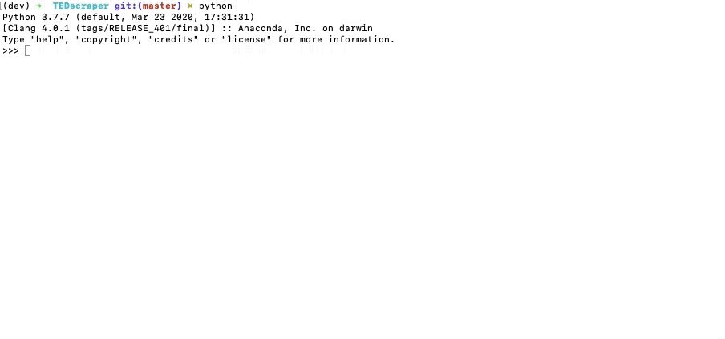

# TED-Talks-Scraper
Scrape TED talk data including transcripts in over 100 languages from TED.com



## Requirements
[Python 3](https://www.python.org/downloads/)  
[Requests](https://2.python-requests.org/en/master/)  
[Beautiful Soup 4](https://pypi.org/project/beautifulsoup4/)  
[fake-useragent](https://pypi.org/project/fake-useragent/)  
[Pandas](https://pandas.pydata.org/)

## Usage
```python
# import module (or use Jupyter Notebook)
from TEDscraper import TEDscraper

# instantiate the scraper & pass in optional arguments
scraper = TEDscraper(lang_code='en', urls='all', topics='all')

# scrape the data and save it to a dictionary
ted_dict = scraper.get_data()

# transform the dictionary to a sorted pandas DataFrame
df = scraper.to_dataframe(ted_dict)

# output DataFrame as CSV
df.to_csv('../data/ted_talks.csv', index=False)
```
Here is a list of other output formats [Pandas docs](https://pandas.pydata.org/pandas-docs/stable/reference/frame.html#serialization-io-conversion).

### Parameters
* **lang_code**
    * English is the default language `lang_code='en'`
    * You can pass in other language codes using the `lang_code` param
    * TED translators don't always translate all features
        * Ex: Title and 'About Speaker' might be in English while the transcript is translated to French
* **urls** 
    * All urls are scraped by default for the selected language `urls='all'`
    * You may pass in a list of urls. However, there are a few limitations:
        * TED must have the talks available in the language you specify
        * Only one language can be provided per scrape call
* **topics**
    * All topics are scraped by default `topics='all'`
    * You may pass in a list of topics to filter by them
* **force_fetch**
    * Talks with known issues are skipped by default `force_fetch=False`
    * Set it to 'True' to attempt to scrape
    * See [talks with known issues](../data/urls_issues.csv)
* **exclude_transcript**
    * All features are scraped by default `exclude_transcript=False`
    * Set it to 'True' to exclude the transcript

## Features

| Feature          | Description                                     | Data Type  |
|------------------|-------------------------------------------------|------------|
| talk_id          | Talk identification number provided by TED      | int        |
| title            | Title of the talk                               | string     |
| speaker_1        | First speaker in TED's speaker list             | string     |
| speakers         | Speakers in the talk (one or many)              | dictionary |
| occupations      | *Occupations of the speakers (none, one or many)| dictionary |
| about_speakers   | *Blurb about each speaker (none, one or many)   | dictionary |
| views            | Count of views                                  | int        |
| recorded_date    | Date the talk was recorded                      | string     |
| published_date   | Date the talk was published to TED.com          | string     |
| event            | Event or medium in which the talk was given     | string     |
| native_lang      | Language the talk was given in                  | string     |
| available_lang   | All available languages (lang_code) for a talk  | list       |
| comments         | Count of comments                               | int        |
| duration         | Duration in seconds                             | int        |
| topics           | Related tags or topics for the talk             | list       |
| description      | Description of the talk                         | string     |
| related_talks    | Related talks (key='talk_id', value='title')    | dictionary |
| url              | Url of the talk                                 | string     |
| transcript       | Full transcript of the talk                     | string     |

*The dictionary key maps to the speaker in ‘speakers’.

## Languages
TED talks have been subtitled in over 100 languages. Here are the top languages:

| Code  | Language              |
|-------|-----------------------|
| en    | English               |
| es    | Spanish               |
| pt-br | Portuguese (Brazilian)|
| fr    | French                |
| it    | Italian               |
| zh-cn | Chinese (simplified)  |
| zh-tw | Chinese (traditional) |
| ko    | Korean                |
| ja    | Japanese              |
| tr    | Turkish               |
| ru    | Russian               |
| he    | Hebrew                |

Here is a link to [all language codes available as of April 2020](../data/languages.csv).

You can see all the talks for each language at [TED – Our Languages](https://www.ted.com/participate/translate/our-languages 'TED languages').

## Meta
Author: Miguel Corral Jr.  
Email: corraljrmiguel@gmail.com  
LinkedIn: https://www.linkedin.com/in/miguelcorraljr/  
GitHub: https://github.com/corralm

Distributed under the MIT license. See [LICENSE](./LICENSE) for more information.

The data has been scraped from the official TED Website and is available under the Creative Commons License.

## Contributing
1. Fork it (<https://github.com/yourname/yourproject/fork>)
2. Create your feature branch (`git checkout -b feature/fooBar`)
3. Commit your changes (`git commit -am 'Add some fooBar'`)
4. Push to the branch (`git push origin feature/fooBar`)
5. Create a new Pull Request